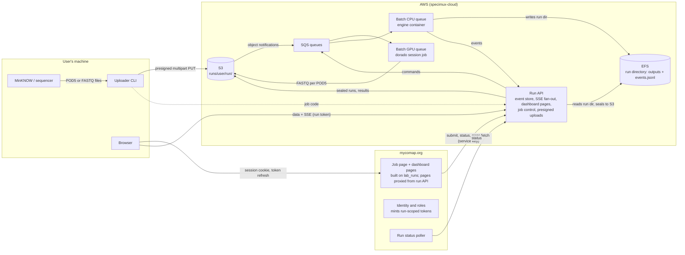
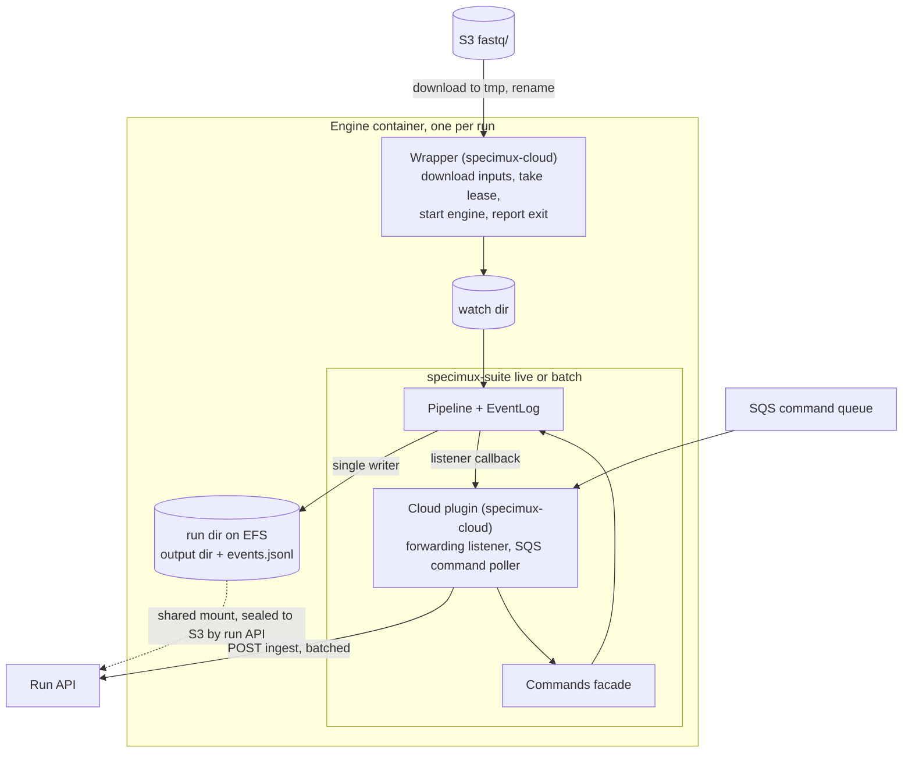
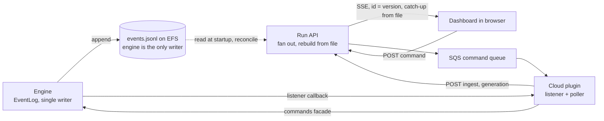
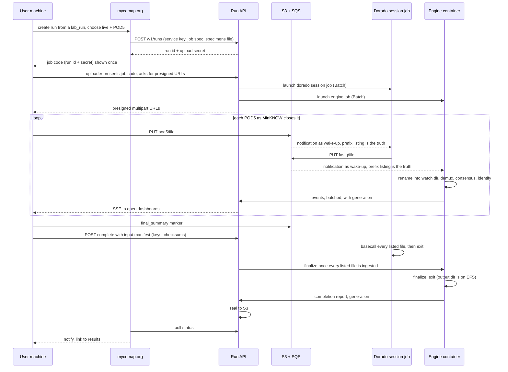
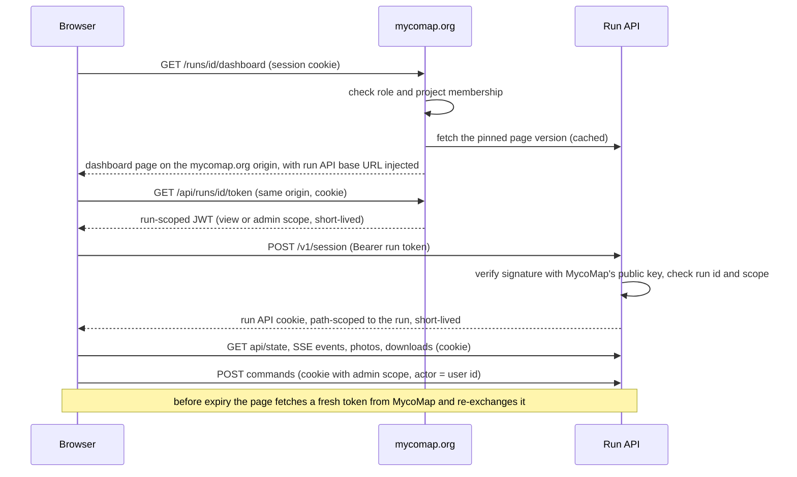

# Cloud Compute Design

Design for running specimux-suite as a hosted service fronted by
mycomap.org. This is a working document on the `cloud` branch; it records
the decisions, the reasoning behind them, and the questions still open. It
is written to be shared with collaborators, so it assumes familiarity with
the pipeline (see README and INTEGRATION.md) but not with earlier
conversations. Facts about mycomap.org come from a read of its codebase in
September 2026 and should be re-checked against the code before they are
built on.

Status: milestone 1 (the suite's extension interface and restart
hardening) is implemented on this branch; milestone 2 is in progress in
the `specimux-cloud` repository. Two rounds of external review by GPT
Astra ([CLOUD_REVIEW.md](CLOUD_REVIEW.md), September 2026) are folded in;
the reliability material under "Operational correctness" is largely a
response to them.

## Summary

specimux-suite today runs on a laptop next to the sequencer. This design
makes the same pipeline available as a hosted service. A lab sets up a run
on mycomap.org, uploads reads (raw POD5 or already-basecalled FASTQ) with
a small command-line tool, and watches the same live dashboard on
mycomap.org while AWS does basecalling, demultiplexing, consensus and
identification. Results come back as the package MycoMap already accepts.

Three codebases share the work and touch each other in a few named
places. The pipeline (specimux-suite) stays cloud-unaware and keeps
working offline for forays. A new service repository (working name
`specimux-cloud`) holds everything AWS-specific. mycomap.org provides
accounts, permissions and the job page, and needs a small, fixed list of
additions collected under "What mycomap.org builds".

Cost is bounded by running one job at a time to begin with: a few dollars
of compute per run, tens of dollars a month of fixed cost, and cents a
month to keep a run's raw signal forever. The milestones prove a batch
FASTQ run end to end on a laptop, then in AWS, then through mycomap.org,
before live runs and GPU basecalling are added.

## How to read this document

- **Everyone:** Summary, Goals, Two use cases, System topology, Run
  lifecycle. The Glossary at the end defines the sequencing and pipeline
  terms.
- **Lab users and MycoMap's maintainer:** Basecalling stage, Uploads and
  storage, Job configuration and display, Reference database, Results into
  MycoMap, Plate and index validation, Cost, and the open questions
  addressed to MycoMap's maintainer.
- **mycomap.org developers:** What mycomap.org builds, Identity and
  authorization, Dashboard hosting and reskinning, Local development
  stack, Contracts and versioning.
- **Suite and service implementers:** The engine container, The run API,
  Operational correctness, Milestones, Rejected alternatives.

## Goals

The service must satisfy these functional needs. Where something does not
fit naturally into specimux-suite, it gets a proper home elsewhere rather
than being cut.

- An AWS compute node runs the backend jobs: specimux, speconsense and
  reference-database identification.
- An AWS GPU node runs dorado basecalling, optionally. Some users upload
  POD5 and need basecalling; others upload FASTQ already called on their
  own GPU.
- mycomap.org is the identity provider, does authentication and
  authorization, and is the user's front door.
- An uploader tool on the user's machine moves run data to the cloud.
- Job status on mycomap.org is as rich as the local dashboard, for both
  live and batch runs.
- Live and batch keep working in pure local mode with no AWS or mycomap.org
  dependency. The cloud pieces attach at an abstraction layer; they do not
  change the engine.
- S3 holds POD5, FASTQ, outputs and result packages. SQS carries the
  asynchronous request and response traffic inside AWS.
- The event stream reaches the user's browser with sub-second latency
  during a run.

## Two use cases

specimux-suite was designed for one setting and is now wanted in a second:

1. **The foray demo.** A sequencer in a room full of people, results
   streaming to a projector, an operator at the laptop. Everything runs
   locally because venue internet cannot be trusted. The `/present`
   highlights screen, the photo cache, the share-by-QR mode and the live
   Forecast tab all exist for this setting.
2. **Day-to-day lab runs.** Regular sequencing runs processed during or
   after acquisition, by a small number of people, with no audience. What
   matters is turnaround, validation of the sample sheet, and getting
   results out.

Cloud compute targets the second use case first. Because live mode runs in
the cloud unchanged (see "The engine container"), a foray could later use a
hosted run with the projector on the viewer, but the concerns listed under
"Foray mode and the cloud" apply and nothing here makes the local,
offline-capable path worse.

## System topology

Three codebases, three homes. specimux-suite is the engine and knows nothing
outside one job. A new service repository (working name `specimux-cloud`)
owns everything AWS-specific. mycomap.org owns identity and the user-facing
job page.



| Home | Owns | Must not know about |
|---|---|---|
| **specimux-suite** (engine) | The pipeline, the local web server and its API, the dashboard pages, `derived.js`, the event contract. Runs one job in one container with one output dir. | AWS, MycoMap, identity, other runs. |
| **specimux-cloud** (service) | Infrastructure as code, the engine container image and the cloud plugin that runs inside the engine, the dorado image, the run API, the uploader CLI, storage layout, quotas, retention. | Who a user is beyond a verified token. |
| **mycomap.org** | Identity, roles, project membership, the job page, token minting, a status poller, notifications to the user. | The pipeline, the event schema, AWS. |

The integration surfaces between them are deliberately few and are listed
under "Contracts and versioning".

## The engine container

The cloud attaches to the engine through a small extension interface in
specimux-suite, and the AWS-specific code that uses it lives in the
service repo as a plugin package. The engine keeps reading and writing
plain directories; a thin wrapper in the container handles what happens
outside the engine's lifetime.



### The suite's extension interface

Three changes to specimux-suite, each worthwhile on its own:

1. **A viewer app factory.** The read side of the web server (`api/state`,
   `events` as SSE, `api/specimens`, `api/sequence/...`, the static pages)
   built from an event log plus an output dir, with no pipeline required.
   The local server mounts it once; the run API mounts it per run id over
   a stored log; `tests/tools/serve_fixture.py` becomes a one-liner.
2. **A commands facade.** One object with `watch`, `unwatch`, `correct`,
   `dismiss`, `rescan`, `finalize` and `abort`. The local web routes call
   it instead of reaching into the pipeline, tests call it directly, and
   the cloud plugin calls it from its command poller. Finalize and abort
   stop being a keyboard interrupt, which also gives a foray operator
   remote finalization.
3. **Plugins.** The engine loads named plugins through Python entry
   points (`--plugin cloud`) and hands each one a context: the event log,
   the commands facade, the config and the output dir, with start and
   shutdown hooks. A plugin may register `EventLog` listeners and start
   threads. The suite ships one plugin of its own, an HTTP forwarding
   listener (`--forward-events URL`), because mirroring a run to a remote
   read-only screen is also the foray "public screen" feature; it has no
   AWS dependency.

### What the cloud plugin does

- **Events out.** The forwarding listener queues each event as the log
  emits it and a background thread POSTs batches to the run API (a short
  flush window, or whenever a batch fills), tagged with the log version so
  the run API can dedupe after a retry. If the run API is unreachable the
  listener buffers to disk and retries. The engine's own `events.jsonl`,
  on the run's EFS directory, is the persisted record; ingest exists for
  latency and fan-out, not durability. Every batch carries the run's
  generation as a fencing token (see "Operational correctness").
- **Commands in.** A thread polls the run's SQS command queue and calls
  the commands facade. Commands are typed calls, not HTTP replays, and the
  engine's loopback-only admin web surface is not involved.

### What the wrapper does

- **Input.** Lists the run's `fastq/` prefix (S3 notifications are only a
  wake-up; listing is the source of truth, since notifications are
  at-least-once and can be late or duplicated), downloads each new file to
  a temp name on the run's EFS directory and renames it into the watch
  dir. The engine's watcher is size-stable-for-settle-time, so the rename
  guarantees it never sees a partial file. It records each ingested file,
  which is what the completion barrier checks. Batch mode downloads
  everything before starting the engine.
- **Output dir on EFS, not job-local disk.** The engine's output dir is
  the run's directory on EFS, shared with the run API. There is no
  periodic sync: sequences and photos are visible to the viewer the moment
  the engine writes them, and an engine job that dies is relaunched on the
  same directory, where it reopens the same event log, continues the same
  version sequence and heals through the suite's existing restart
  recovery. A copy of a changing directory was never a consistent
  checkpoint. Caveat: EFS has per-operation latency far above local disk,
  and demux appends to hundreds of per-specimen FASTQ files while
  snapshots copy them. Milestone 2 measures this before anything else is
  built on it. A job-local hot directory mirrored to EFS was considered as
  a fallback and rejected: it reintroduces the inconsistent-copy problem
  and would need its own recovery protocol.
- **Restart and fencing.** Relaunch on the same directory, the demux
  commit boundary and the generation lease are specified under
  "Operational correctness".
- **Exit.** After the engine exits, the wrapper reports completion or
  failure to the run API with the exit code, generation and log tail.
  The run API then seals the run: copies the output dir and log to S3 and
  later removes the EFS copy. Keeping the wrapper outside the engine
  process means an engine crash and a wrapper failure are distinguishable.

Commands stay separate from events on purpose. The engine's `EventLog` is
the single writer of a run's log; a user action becomes a command that the
engine turns into an event, exactly as the local web server does today.

## The run API

A small always-on service in AWS. It is the only thing the browser, the
uploader and mycomap.org talk to, and the only thing the engine's cloud
plugin talks to. It does five jobs:

1. **Event store.** The engine's own `events.jsonl` on the run's EFS
   directory is the persisted record; it has one writer and monotonic
   versions. Plugin ingest pushes the same events for fan-out and keeps
   the run API's in-memory state current; on startup the run API rebuilds
   from the file and dedupes ingest by version. Sealed to S3 when the run
   ends. This keeps the support story the same as local runs: download the
   log, replay it locally.
2. **Viewer.** Serves the existing dashboard contract for any run id under
   a run prefix: `api/state`, `events` as SSE with the log version as
   event id and catch-up from the file, `api/specimens`,
   `api/sequence/...`, and the static pages. This is the suite's viewer
   app factory mounted per run; the run API pins a specimux-suite version
   and imports it. Two rules the local server does not need, faithful
   replay while a run is live and artifact access that keeps the JSON
   contract after sealing, are under "Operational correctness".
3. **Job control.** Create a run from a job spec, report status, accept
   commands from an authorized dashboard and forward them to the run's SQS
   queue, launch and watch the Batch jobs, enforce the one-active-run
   cap. Its durable state and failure handling are under "Operational
   correctness".
4. **Uploads.** Issue presigned multipart URLs to the uploader and
   presigned PUTs to the browser for small FASTQ files.
5. **Results.** Serve the results package and the sealed log. The
   package is the same summary package MycoMap accepts for upload today,
   so results flow into MycoMap through an existing door (see "Results
   into MycoMap").

Proposed endpoint shape, all under `/v1`:

| Endpoint | Caller | Auth |
|---|---|---|
| `POST /v1/runs` | mycomap.org | service key |
| `GET /v1/runs/{id}` (status) | mycomap.org, dashboard | service key or run token |
| `POST /v1/runs/{id}/uploads` (presigned URLs) | uploader, browser | job code, or upload-scope run token from the job page |
| `POST /v1/runs/{id}/complete` (no more input) | uploader, job page | job code or service key |
| `POST /v1/runs/{id}/ingest` | engine (cloud plugin) | per-job secret |
| `GET /v1/ui/{version}/...` (pages and assets) | mycomap.org proxy, local link | none (static) |
| `GET /v1/version` | mycomap.org | service key |
| `POST /v1/session` (run token to cookie) | browser | run token (Bearer) |
| `GET /v1/runs/{id}/api/state`, `.../events`, `.../api/specimens`, `.../api/sequence/...`, `.../photos/...` | browser | run API cookie, view scope |
| `POST /v1/runs/{id}/commands` | browser | run API cookie, admin scope; `Origin` checked |
| `GET /v1/runs/{id}/results.zip`, `.../events.jsonl` | browser, mycomap.org | run API cookie or service key |
| `GET /v1/options` (profiles, references, dorado models) | mycomap.org | service key |
| `POST /v1/references` (publish a reference version) | mycomap.org | service key |
| `DELETE /v1/runs/{id}` | mycomap.org | service key |

The run API is one Fargate task with EFS mounted. SSE fan-out is in-process,
so a second task would need shared pub/sub (or routing by run id); that is
a later problem and the design does not preclude it. It needs TLS and a
hostname, and it sends an SSE heartbeat comment every 15 seconds because
load-balancer idle timeouts are shorter than a quiet stretch of a live run.

### Event stream to the browser



Latency is the listener's flush window plus two hops, well under a second. The
volume is small: a captured ont98 run is a few thousand events and a few
megabytes over the whole run, with bursts of several hundred
`specimen.updated` events right after each demux. A browser that
disconnects reconnects with `Last-Event-ID` and catches up from the file,
which is the existing client behaviour.

The alternatives considered and set aside: writing event chunks to S3
(latency equals the flush interval and still needs a poller);
API Gateway WebSockets with DynamoDB and Lambda (reimplements catch-up and
fan-out the suite already has); AWS IoT Core (cheap fan-out but its browser
auth model fights the token flow below); proxying the stream through
mycomap.org (see "Identity").

## Run lifecycle

A run has a mode (live or batch) and an input kind (FASTQ or POD5),
independently. Live with POD5 is the full path:



The other combinations are subsets:

- **Live, FASTQ.** No GPU stage; uploads land in `fastq/` directly. The
  user's own basecaller must be configured for the same model and qscore
  filter the service uses, or results will not be comparable across runs.
- **Batch, POD5.** Everything is uploaded first. The dorado job starts on
  `complete` and runs once; the engine starts when basecalling finishes and
  runs `specimux-suite batch` on the concatenated FASTQ.
- **Batch, FASTQ.** Upload, `complete`, one engine job. This is the path
  milestones 2 and 3 prove first.

### Run states

| State | Set by | Meaning |
|---|---|---|
| created | run API, on `POST /v1/runs` | spec stored, run id and job code issued |
| uploading | run API, on the uploader's first presigned-URL request | live jobs launched; files arriving |
| input complete | uploader or job page, `POST complete` | no more input; the manifest fixes exactly which files belong to the run |
| basecalling | dorado job | POD5 runs only; FASTQ appearing per POD5 file |
| running | engine job | demultiplexing, consensus, identification, live dashboard |
| finalizing | run API sends `finalize` once every listed file is ingested | engine processes stragglers and summarizes, then exits |
| sealed | run API, after the wrapper's exit report | output dir and log copied to S3; EFS copy removed later; results package available |
| failed | wrapper's exit report | engine exited with an error; log tail on the run record |
| incomplete | idle timeout | run abandoned mid-way; what was processed is kept, success is never reported |

Completion is a verifiable barrier rather than a signal: `complete`
carries a manifest of every uploaded object, "ingested" means the engine
has emitted `specimux.completed` for the file, and S3 notifications are
only a wake-up. The details are under "Operational correctness".

### Input: what MinKNOW produces

MinKNOW writes POD5 in batches of reads, 4000 reads per file by default
(the same number `specimux-replay` uses), so a MinION run is hundreds to
thousands of files named `<flowcell>_<run>_<acquisition>_<index>.pod5`.
With live basecalling off they land in a single `pod5/` directory; with it
on they split into `pod5_pass/`, `pod5_fail/`, `pod5_skip/`. For cloud
basecalling the sequencer laptop runs with live basecalling off.

For ITS amplicon runs the files are tens of megabytes each and a run is
tens of gigabytes in total. The many-file layout means uploads are chunked
and resumed per file, and basecalling can start before the run finishes.
MinKNOW writes `final_summary_*.txt` into the run folder when acquisition
ends; the uploader forwards it and sends `complete`.

### Basecalling stage (dorado)

Basecalling is a stage owned by the service, not the suite. The suite keeps
taking FASTQ. Stage progress ("basecalling, 40%") is job-level status on
the run record, not suite events.

**GPU, not CPU.** Dorado runs on CPU with `-x cpu`, but ONT's own guidance
is that CPU basecalling is only sensible with the fast model, and the gap
is orders of magnitude. Order-of-magnitude figures for a run of roughly a
gigabase of called bases (a typical amplicon MinION run), from ONT's
published throughput and community benchmarks rather than our own
measurements:

| Setup | HAC | Fast |
|---|---|---|
| g5.xlarge (A10G), ~$1/hr | ~10 min | minutes |
| g4dn.xlarge (T4), ~$0.50/hr | ~20–30 min | ~10 min |
| 16-core CPU, ~$0.70/hr | many hours to a day | 1–3 hours |

SUP is several times slower again on every row. GPU HAC costs well under a
dollar per run; CPU HAC costs more in instance hours than the GPU did and
takes a day. The fast model is rejected for a different reason: it changes
the data. Lower raw accuracy means more reads failing specimux's primer and
barcode matching and noisier speconsense clusters, and every baseline we
have (including the ont98 validation runs) comes from HAC or SUP calls. The
service should reproduce bench results, not a cheaper approximation. The
CPU path stays as a flag for a tiny test run or a region with no GPU
capacity.

**Model and filtering** should match the lab's current practice on its own
GPU: HAC vs SUP, and the min-qscore filter that produces the "filtered
calls" FASTQ the suite has always been fed. Dorado runs without barcode-kit
options; specimux does the demultiplexing. The dorado version and model
name are recorded in the run manifest.

**AWS Batch on EC2.** A GPU compute environment with a zero-minimum
instance count spins up a g4dn or g5 only when a job is queued and tears it
down afterward. Batch selects the ECS GPU-optimized AMI (with the NVIDIA
driver) for those instance families; the job definition declares one GPU.
Dorado's Linux tarball bundles its CUDA runtime, so the container is the
tarball plus the model files. Spot pricing roughly halves the cost if
preempted jobs are retried. Fargate is out: it has no GPU support.

**A session job per run.** During a live run the GPU is idle most of the
time however the work is sliced: a MinION emits on the order of a gigabase
per hour at peak, and an A10G calls that in a few minutes. So the question
is whether idle GPU time during a run is worth paying for, and at fifty
cents to a dollar an hour it costs a few dollars per run. One Batch job
starts when the first POD5 lands, consumes the run's SQS queue, basecalls
each file within seconds of arrival, and exits on `complete` or an idle
timeout. It writes one FASTQ per POD5 file, named to match, so a job that
dies and restarts skips what is already done. Periodic batch jobs every
20–30 minutes were considered and rejected: a GPU instance takes minutes to
boot, pull a multi-gigabyte image and load the model, and Batch keeps idle
instances a few minutes anyway, so at short intervals you pay for the idle
instance regardless and gain only moving parts. Basecalling after the run
is the same job with a deferred start.

### Suite stage

The engine container runs `specimux-suite live` or `batch` with its output
dir on the run's EFS directory (see "What the wrapper does"). Both browser
auto-open and the console are already no-ops without a tty. Speconsense is the CPU hog, so instance size
follows the worker count; per-run cost is on the order of a dollar or two
of CPU time.

## Identity and authorization

mycomap.org already has what is needed: cookie sessions and mobile JWTs,
per-user API keys, a stable `users.id`, roles (`admin`, `member`,
`project_leader`, `project_assistant`, `lab_contributor`) and per-project
membership. What it lacks is any way to mint a token a third party can
verify, and that is the one addition on its side.



- **Run-scoped tokens.** MycoMap mints a JWT with the user id, run id,
  scope (`view`, `admin` or `upload`) and a short expiry. The run API
  verifies it and nothing else. Use RS256 with a keypair made for this
  purpose so the run API holds only the public key; do not reuse a secret
  MycoMap signs its own sessions with, which would let the run API mint
  MycoMap sessions. `jsonwebtoken` is already a MycoMap dependency.
- **Do not proxy the stream through mycomap.org.** It sits behind a CDN
  whose idle timeout is shorter than a quiet stretch of a live run, and a
  deploy restarts its process, which would sever every proxied stream. The
  browser connects to the run API directly for data and SSE; MycoMap adds
  the run API origin to its CSP `connect-src`, and `img-src` for the run
  API's photo cache and the iNaturalist and Mushroom Observer image hosts
  the pages fall back to.
- **The page itself comes from mycomap.org** (see "Dashboard hosting"),
  so it shares the session cookie and token refresh is a same-origin
  fetch. No frame, no cross-origin handoff.
- **Browser transport: a run API cookie on a mycomap.org subdomain.** The
  dashboard uses the native `EventSource`, which cannot send a bearer
  header, and image tags and download links cannot either. So the run API
  is hosted on a subdomain of mycomap.org (say `runs.mycomap.org`, a DNS
  record MycoMap points at AWS), and the page exchanges its MycoMap-minted
  run token for a short-lived, `HttpOnly`, `Secure` run API cookie
  (`POST /v1/session`). Requests from mycomap.org to its subdomain are
  same-site, so the cookie rides `EventSource` (with credentials), photo
  tags and download links with no page changes, and third-party cookie
  blocking never applies. Refresh is a re-exchange before expiry; the
  server closes an SSE stream shortly after its cookie expires and the
  client reconnects with `Last-Event-ID` after refreshing, which is the
  existing catch-up path. The cookie is path-scoped to the run
  (`Path=/v1/runs/{id}/`), so two dashboards open in two tabs hold two
  cookies rather than overwriting one. The subdomain is same-site but
  still cross-origin, so page fetches send credentials explicitly, CORS
  allows the mycomap.org origin with credentials, and the run API checks
  the `Origin` header on every mutation. Fallback if the subdomain is
  unavailable: a query-string token for SSE and signed URLs for
  artifacts.
- **Audit log.** Every command carries the user id from the token. The
  run API keeps a per-run log of commands (who, what, when) independent of
  the engine, and the engine records the actor on the event it emits, so
  the run's own log says who starred a specimen or applied a correction.
  Locally the actor is the operator. This is an additive field on the
  mutation events and on the commands facade.
- **Who may submit, who may see.** Submission requires `lab_contributor`
  or `project_leader`; viewing requires project membership or admin. A run
  therefore carries a project id from the start. There is no generic ACL
  in MycoMap, so run visibility is derived, not stored per run.
- **Service key.** mycomap.org calls the run API's job-control endpoints
  with a service key, following its existing thin-proxy pattern for
  mycomap.com, MycoBLAST and iNaturalist. Completion reaches MycoMap by
  its existing pattern too: a polling loop over a run table, which
  tolerates MycoMap being down when a run finishes. A signed webhook (the
  Stripe and PayPal pattern) can be added later; it must be exempt from
  the site's API rate limiting.
- **Uploader identity: the job code.** The user's flow is: set up the run
  on mycomap.org, MycoMap creates it against the run API, the job page
  shows a job code, the user runs the uploader with that code. The code is
  the credential; no login on the CLI. Two identifiers are minted when the
  run is created: a short public run id, which appears in URLs, links,
  notifications and logs, and a random upload secret. The job code the
  user copies joins the two, so nothing that is shared or screenshotted
  carries upload rights. The secret is upload-scope only (presigned URLs
  and `complete`; it cannot view results or issue commands), stored hashed
  on the run API like an API key, shown once with a regenerate button that
  invalidates the old one, and dead once the run is complete and sealed.
  The uploader talks only to the run API and never to mycomap.org, whose
  upload path is sized for browser uploads and whose bot protection can
  block non-browser clients. It works headless and over SSH for the same
  reason.
- **Per-job secret.** Each Batch job gets a secret in its environment for
  plugin ingest and the wrapper's completion report. The plugin reads SQS
  with the job's IAM task role.

## Uploads and storage

The uploader is a small CLI in the service repo, invoked with the job code
and the run folder. It watches the folder, uploads each file as MinKNOW
closes it via presigned multipart PUT straight to S3, resumes per file,
forwards `final_summary_*.txt`, then calls `complete`. It should ship as a single binary for collaborators who do
not have a Python environment; keeping it in the service repo leaves the
language open. A browser path for small FASTQ uploads uses presigned PUTs
from the same endpoint.

What the user uploads is the original signal, and it is kept
indefinitely: as basecalling models and pipeline steps improve, older runs
can be re-processed from POD5 without anyone finding the files again. So
an upload is an *archive*, and a run *references* an archive. Re-processing
is a new run pointed at an existing archive, with no upload. A FASTQ-only
upload is archived the same way, since it is the best signal that user has.

```
archives/<user_id>/<archive_id>/
  manifest.json      flow cell, kit, MinKNOW final_summary, uploader version
  pod5/              uploaded POD5, or
  fastq/             uploaded FASTQ when the user basecalled locally
runs/<user_id>/<run_id>/
  manifest.json      job spec: archive id, mode, dorado model, all versions
  input/             primers.fasta, specimens.txt, a user reference.fasta if supplied
  fastq/             basecalled FASTQ, one per POD5 file (regenerable)
  output/            the engine's output dir, sealed here from EFS when the run ends
  events.jsonl       sealed copy of the run's log
  results.zip        the summary package MycoMap accepts today, plus events.jsonl
references/          versioned reference databases plus an index (see "Reference database")
```

Retention and lifecycle:

- **Archives are permanent.** A lifecycle rule moves them to S3 Glacier
  Deep Archive after 30 days (about three cents a month for a 30 GB run,
  versus seventy at Standard). Restoring for re-processing takes up to
  twelve hours and is a job-level step the service performs before
  launching a run against an archived input; Glacier Flexible Retrieval
  (minutes, at a few times the price) is the alternative if that wait
  proves annoying. Users cannot delete archives; an administrator can, for
  a data-governance request.
- **Runs are the user's to delete.** The delete button removes the run's
  outputs, log and results; the archive stays. Basecalled FASTQ under a
  run is regenerable from the archive and can be expired earlier.
- **A short retention statement** on the job page says all of this, which
  users abroad will ask about along with region.

## Job configuration and display

Two separate questions: who decides what a run is configured with, and
where a user sees what a run is doing.

**mycomap.org owns configuration.** The job page assembles the job spec:
the archive (a new upload or an existing one), mode (live or batch), input
kind, the basecalling model and qscore filter for POD5 runs, the reference
version, a named suite profile, and the run's inputs. The specimens file
and the primers file are both generated from the `lab_run` (plates, wells
and index sets for one; primer sets and pools for the other), so a user
normally uploads nothing but reads. Standing defaults live in a MycoMap
admin-editable record and are rarely changed; the page shows them
collapsed under an "advanced" disclosure, and most submissions are the
defaults plus a run.

**The run API publishes the choices and validates the spec.** It exposes
the option lists (named profiles, reference versions, dorado models) so
the job page is a form over what the run API offers and hardcodes nothing;
this is part of C4. It validates a submitted spec against a schema, stores
it in the run manifest, and maps it to what the stages consume: a suite
profile YAML plus flags for the engine, dorado arguments for the GPU job.
Suite profiles (see INTEGRATION.md) are the vehicle for pipeline settings;
the service ships a small set of named profiles (`lab-default` to begin
with) and the spec allows a short list of overrides on top (minimum reads,
reprocess ratio). Anything beyond that list becomes a new named profile
rather than a new form field, which keeps the spec small and the profiles
the thing that is versioned and tested.

**Display has two surfaces with a clear split.** The job page shows
job-level state: queued and the position in the queue, basecalling with
its progress, running, finalizing, sealed or failed, plus the spec as
submitted, the versions from the manifest, and links to the dashboard,
the results and the log. That state lives on the run record and is not a
suite event, as noted under "Basecalling stage". The dashboard shows what
the engine is doing and what it actually ran with: `pipeline.started`
already carries a summary of the effective configuration, so the run's
real parameters are in the event log and the snapshot. The job page reads
the effective configuration back from the run API's status rather than
trusting its own spec, so a mismatch between what was asked for and what
ran is visible instead of hidden.

## Reference database

The reference database is a heuristic guide for monitoring sequence
quality during a run, not the final authority on identification. That
framing sets the priorities: what matters is that every run records which
reference it used, that the default is current, and that fetching it costs
nothing noticeable. Overriding it is rare and secondary.

- **Versioned objects in S3.** References live under a `references/`
  prefix as immutable, dated objects with a small index listing name, date,
  size and checksum (`mycomap-2026-03-15.fasta`, and so on). The run API
  exposes the list; the job page defaults to the newest and lets the user
  pick an older one. A run's manifest pins the exact object, so replaying
  the run reproduces its dashboard.
- **mycomap.org publishes new versions.** The expectation is that MycoMap
  exports its data as a fresh reference regularly. Publishing is a write
  to the `references/` prefix plus an index update, through the run API
  with the service key, so MycoMap needs no S3 credentials for it. The
  contract is unchanged: a FASTA with `name="..."` headers and nothing
  else consumed.
- **Fetched per job, not baked in.** The MycoMap reference is about 75 MB,
  seconds from S3 to the job's local disk, so the engine image stays
  reference-free and a new reference needs no image rebuild. Very large
  references (UNITE is over a gigabyte) would still work but are not the
  target.
- **User-provided references** are supported as an upload into the run's
  `input/`, with the same header contract, since minting one's own
  references is a deliberate feature of the suite. It is expected to be
  rare, especially for batch, and gets no job-page prominence.

## Caches, outbound APIs and concurrency

The first version runs **one active run per stage**. The cap is enforced
by the run API's admission check on the run record before a job is
submitted, so a second submission is held as queued and the job page shows
its position. The Batch compute environment's size is only a backstop:
Batch caps by vCPUs rather than instances, some allocation strategies may
overshoot by one instance, and two small jobs can share one instance, so
it cannot be the cap on its own. This bounds compute cost with a few lines
of logic, and raising the limit later is a number change. A POD5 live run
holds one GPU instance and one CPU instance, bounded separately. The known consequence is that a live run
holds the engine instance for the length of sequencing, so a second lab's
run would wait hours; that is acceptable for one lab and is the first
thing to revisit when another joins. Concurrent jobs are an expected
later step, not a design constraint.

With one engine at a time, outbound traffic to iNaturalist and Mushroom
Observer is exactly the local situation and the suite's existing pacing
applies. One addition is worth making in the suite regardless: the
`User-Agent` should carry a contact URL alongside the name and version, as
iNaturalist's API guidelines ask, since a fixed egress address running many
runs is the traffic they would otherwise throttle.

The suite caches per output dir, with no timestamps: an iNat lineage cache
(genus and any-rank taxon to ancestor ids; stable), the photo cache
(stable), and the iNat and MO taxon caches (observation to community
taxon, observer and photos; refined over time by experts). In the cloud
the wrapper seeds each run's output dir from a shared cache directory on
EFS before the engine starts and merges the run's caches back after it
exits, a plain key union. With one run at a time there are no concurrent
writers, and because the union is idempotent an overlap would be benign
rather than corrupting. Only the lineage and photo caches are shared. The taxon caches are fetched fresh every run: a
cold fetch is about half a minute for several hundred observations, and
freshness is the point, since a re-processed run should show an
observation's current identification. When concurrency arrives, the
merge-back needs a lock or a small key-value store, and the taxon caches
want a fetched-at field and a short TTL inside the suite; neither is
needed for one job at a time.

## Results into MycoMap

MycoMap already accepts a summary package upload from a run, the same
package a user builds from the suite's `summary/` output today (patched
with `inat_id_corrections.tsv` when corrections were applied). The results
package the service produces is that package, byte-for-byte in layout,
plus the sealed event log. So results reach MycoMap through the existing
upload path, and a later "send to MycoMap" button on the job page is a
server-to-server hand-off of a file MycoMap already knows how to read,
not a new ingestion format.

Two things to confirm before building on this. The upload may currently
be supported only on mycomap.com, not mycomap.org; and mycomap.com is
intended to be retired by the start of 2027, so one way or another
mycomap.org will accept sequence data by then. The service should target
whatever that mechanism is rather than invent one.

## Plate and index validation

This is the feature that motivated the "hit a button and catch mistakes
immediately" request. It belongs in the suite, because the raw signals are
the suite's: "Surprise" detection (confident DNA far from the field ID),
the iNaturalist typo audit, and per-specimen read counts. What is missing
is aggregating them by plate position and index so a rotated plate, a
row-or-column swap, a wrong index set or an off-by-one sample sheet shows
up as a pattern instead of a scatter of individual surprises.

mycomap.org changes what this can be. It already holds the wet-lab model:
`lab_runs` to `lab_plates` (96 wells, orientation, primer pool, forward and
reverse index sets) to `lab_wells` (position, platform and observation id,
a link to the specimen), plus `index_sets`, `primer_pools`, and an
Index.txt parser. Two consequences:

- The job page can generate the specimens file from the run's plate layout
  instead of asking the user to upload Index.txt, removing the most
  error-prone step. The same generator would help local users if MycoMap
  exposes it as a download.
- The validator gets the intended layout as input, so it tests hypotheses
  ("plate 2 rotated 180 degrees", "rows shifted by one") against ground
  truth rather than inferring structure from scatter. In the suite this is
  a plate-layout input (optional; absent for users with a bare Index.txt)
  and a report; the correction path in batch mode is "fix the sheet,
  resubmit", since demux depends on index assignment.

Design the failure-mode list with the lab against what it actually sees.

## Dashboard hosting and reskinning

mycomap.org serves the dashboard pages on its own origin, proxied from
the run API rather than copied. A MycoMap route such as
`/runs/{id}/dashboard` fetches the page and its assets (`derived.js`, the
stylesheet) from the run API's pinned page version, caches them, and
serves them under a MycoMap path with a small runtime config injected: the
run API base URL for this run and the token endpoint. Locally the suite's
own server injects the defaults, so one set of pages serves both.

Why this and not the alternatives:

- **Copies in MycoMap's React app** (its stated preference) would drift:
  pages and the event contract change together (the Mushroom Observer
  work touched both), and a copy would lag the run API's pinned suite
  version. Proxying the pinned version keeps pages and contract in one
  release with no work on MycoMap's side when the suite updates.
- **Pages served from the run API origin** would need a frame or a
  cross-origin token handoff, since the page could not see MycoMap's
  session cookie. Serving on the MycoMap origin makes token refresh a
  same-origin fetch, gives real URLs and a working back button, needs no
  `frame-src` entry, and keeps the run API hostname an implementation
  detail.

What it demands of the pages: every fetch and asset reference goes through
the injected base URL, never a relative path. That is the explicit,
versioned frontend contract (C3) made mandatory, and the suite's page tests
should exercise the pages served from a foreign origin with an injected
base. The static bytes are trivial and cacheable; the long-lived streams
still bypass MycoMap.

MycoMap will want the dashboard to look like part of its site. Three
levels, cheapest first:

1. **Theme hooks in the pages.** Colours and fonts as CSS custom properties
   overridable by a stylesheet MycoMap injects when it serves the page, a
   title and logo slot, and an embed flag that hides the standalone
   chrome. Cheap, and the suite keeps one set of pages.
2. **Wrap it.** Since the page is on MycoMap's origin, MycoMap can wrap it
   in its own layout and navigation without an iframe.
3. **Native MycoMap components** for the pieces it wants deeply integrated
   (a results table on the lab run page, a status badge), built against
   the run API contract and `derived.js`. `derived.js` is a plain UMD
   module already; importing it into React keeps MycoMap's decisions
   (top match, on/off target, agreement rank) in parity with the suite's
   own pages, and the parity harness keeps `derived.js` honest against the
   scheduler. This is the reskin path that does not fork the UI.

Start with 1 and 2. Take 3 piece by piece where MycoMap wants it.

## What mycomap.org builds

Everything mycomap.org needs to add, in the order the milestones need it.
The mycomap.org stub in the service repo (see "Local development stack")
is the executable version of this list, and the contract tests run against
both.

For milestone 3, batch FASTQ end to end:

1. **A DNS record** for `runs.mycomap.org` pointing at the run API in AWS,
   so the dashboard's cookie is same-site.
2. **A token route**, for example `GET /api/runs/{id}/token`. It checks
   the session, the user's role and project membership, and returns a
   short-lived RS256 JWT with the user id, the run id and a scope of
   `view` or `admin`. The keypair is dedicated to this purpose; the run
   API holds only the public key. `jsonwebtoken` is already a dependency.
3. **A dashboard route**, for example `/runs/{id}/dashboard`, plus its
   assets. It fetches the page from the run API (`GET /v1/ui/{version}/...`,
   with the version from `GET /v1/version`), caches it, and serves it on
   the mycomap.org origin with a runtime config injected: the run API base
   URL for this run and the token route above.
4. **CSP entries**: `connect-src` for `runs.mycomap.org`; `img-src` for
   `runs.mycomap.org` and the iNaturalist and Mushroom Observer image
   hosts the pages fall back to.
5. **A minimal job page**: create a run with `POST /v1/runs` (service key,
   a client token for idempotency, the job spec and the specimens file);
   show the returned job code once, with a regenerate button; show status
   from `GET /v1/runs/{id}`; link to the dashboard and to the results
   package.
6. **A run table and a poller**, in the existing `setInterval` pattern,
   that reads run status and notifies the submitter on completion or
   failure.
7. **Role checks**: `lab_contributor` or `project_leader` may submit;
   project members and admins may view. Runs carry a project id.

For milestone 6, the full job page and results flow:

8. **Options and defaults**: the job page becomes a form over
   `GET /v1/options` (profiles, reference versions, dorado models), with
   standing defaults in an admin-editable record and an "advanced"
   disclosure for overrides.
9. **Generated inputs**: the specimens file from the `lab_run`'s plates,
   wells and index sets, and the primers file from its primer sets and
   pools, so the user uploads only reads.
10. **Reference publishing**: an export of MycoMap's data as a
    `name="..."` FASTA, pushed with `POST /v1/references`.
11. **A results receiver**: whatever mycomap.org's summary-package upload
    becomes once mycomap.com retires; the results package matches it.

Later, as wanted: theme and wrap the dashboard (levels 1 and 2 under
"Dashboard hosting and reskinning"), then native components built on
`derived.js`.

What mycomap.org does **not** need: AWS credentials or SDKs beyond what it
has, any queue, any knowledge of the event schema, proxying of the event
stream, or handling of upload traffic. Its single process stays out of
every long-lived connection.

## Local development stack

The whole system runs on a laptop with no AWS account and no mycomap.org,
so that the seams are exercised end to end before either is involved.

**A mycomap.org stub.** A small FastAPI app in the service repo that plays
mycomap.org's part in C4 and the two browser-facing routes, and nothing
more: a login page with a handful of fake users and roles and a session
cookie; a token endpoint minting the same RS256 run tokens with a
development keypair; the job page as a plain form over the run API's
option lists, with run creation under a client token and the job code
shown once; the dashboard proxy route with the runtime config injected;
the status poller; a results download link; and a receiver for the
summary upload so "results into MycoMap" is exercised too.

The stub is the executable form of C4. MycoMap's developers get a running
reference of exactly what their side must do, and one set of contract
tests runs against the stub in CI and against mycomap.org staging before
go-live, which is also how stub drift is caught. It is also the minimal
second identity provider the design promised: it proves the run API
depends on a verified token and nothing else. It must stay minimal on
purpose; any feature it grows that MycoMap lacks is drift waiting to
happen.

**Local backends for the run API.** Storage, queue, launcher and state
store sit behind small interfaces with two implementations each: S3,
SQS, Batch and DynamoDB in AWS; a directory, an in-memory queue, a
subprocess launcher and SQLite locally. The run API's logic is identical
in both, so the AWS integration is a backend swap rather than a second
code path, and the local stack is what CI runs.

**Cookies work locally** because cookies are not port-scoped: the stub and
the run API on two localhost ports are same-site, with a development flag
allowing the session cookie without HTTPS. `/etc/hosts` entries for
`mycomap.local` and `runs.mycomap.local` give a closer rehearsal of the
subdomain layout when wanted.

## Contracts and versioning

Three codebases release on their own cadence, so the integration surfaces
must be few, explicit and versioned. These are all of them:

| Contract | Between | Shape | Versioning |
|---|---|---|---|
| C1 extension interface | suite and cloud plugin | `EventLog` listeners, the commands facade, the plugin context and hooks | a Python API of the suite; the plugin pins a suite version and they ship in one image |
| C2 ingest and commands | cloud plugin, wrapper and run API | event batches (opaque JSON plus run id, version and generation), command messages with ids, command acknowledgement via the emitted event, completion report | `/v1`, additive changes only |
| C3 dashboard contract | run API and pages (served via mycomap.org) | `api/state`, `events`, `api/specimens`, `api/sequence`, commands with actor; the injected runtime config (base URL, token endpoint); events carry `v` | pages are fetched from the run API's pinned version, so they always match it |
| C4 job API | mycomap.org (or its stub) and run API | option lists, create with a validated spec, status with effective configuration, delete, results, version, page fetch, reference publishing, token claims | `/v1`, additive only; the one contract that crosses an organisational boundary, keep it smallest; the stub is its executable form and the contract tests run against both |
| C5 upload API | uploader and run API | presigned URLs, complete | `/v1`; the run API can reject uploader versions below a minimum |

Rules that make this work:

- **specimux-suite releases to PyPI as today.** The service repo pins a
  suite version for both the engine image and the run API's viewer, and
  bumps them together. The dorado image is versioned by dorado release and
  model, independently.
- **The run API passes events through as opaque JSON**, so a run API
  deploy never has to understand an event schema, and in-flight runs on an
  older engine image keep ingesting. Only the viewer's state rebuild
  depends on the suite, and replaying older logs under a newer
  `PipelineState` is already a suite requirement (restart recovery).
- **Deploys must not kill live runs.** The forwarding listener buffers and retries
  across a run API restart; dashboards reconnect with `Last-Event-ID`.
  The engine image a run started on is what it finishes on.
- **The manifest records every version** (suite, cloud plugin, dorado, model,
  reference database), so support can replay any run with what produced
  it.
- **mycomap.org depends only on C4** and on the CSP entries. It can deploy
  whenever it likes, and a suite release reaches its users the moment the
  run API's pin moves, because it proxies rather than copies the pages.

## Operational correctness

The reliability detail, collected in one place so the overview sections
stay readable. Most of it answers the external review.

### Demux has a commit boundary (suite change)

Demux appends reads to per-specimen FASTQ files and emits
`specimux.completed` afterwards; a restart re-runs any file that started but
never completed. Locally that is safe only because the pipeline never
interrupts a demux; a hard kill (power loss locally, a Spot reclaim or OOM
in the cloud) would re-append and duplicate reads. The suite gains
truncate-on-restart: before demux starts, the runner records every
per-specimen file's length in a manifest beside the outputs; on restart, any
started-but- incomplete demux truncates its outputs back to the recorded
lengths before re-running. Appends only grow files, so this is exact. It is
a local fix as much as a cloud one and lands in milestone 1.

### Fencing on a shared filesystem

EFS is NFS and cannot fence a stale writer: a zombie container that still
holds the mount can write to the directory even after its HTTP calls are
rejected. Three layers, none a proof: a relaunch on the same directory
happens only through Batch's own retry, which starts a new attempt only
after the previous container has stopped; the run API never submits another
job for a run until Batch reports the previous one terminal; and the wrapper
takes a lease file in the run directory carrying a service-assigned
generation and a heartbeat, refusing to start over a live lease. Every
ingest batch and the completion report carry the generation, and the run API
rejects anything from a generation below the run's current one.

### Control-plane state

Run records, archives, upload-secret hashes, the command audit log and
Batch job handles live in DynamoDB, one small table each, written with
conditional updates so every state transition (created, uploading,
basecalling, running, finalizing, sealed, failed, incomplete) is atomic
and idempotent:

- **Run creation** takes a client token from mycomap.org, so a retried
  `POST /v1/runs` returns the existing run rather than a duplicate.
- **Commands** get an id when accepted and are written as pending before
  they are sent to SQS. SQS standard queues can redeliver, so the plugin
  dedupes by command id, using the event log as its memory: every event
  the engine emits for a command carries the id, and the plugin rebuilds
  the applied set from the log on restart. Every command produces an
  outcome event, applied, rejected with a reason, or no-op, so the log is
  complete. The run API marks commands applied from ingested outcome
  events and, at reconciliation, from the persisted log itself, so a
  worker that died between writing its event and forwarding it cannot
  leave an applied command pending. Unapplied commands are visible on the
  run's status.
- **Side effects are intents first.** Recording state and calling Batch
  or SQS are separate operations, so the run API writes an intent
  ("launching generation N", "command pending") before the call and the
  result after it. Batch jobs get a deterministic name from run id and
  generation, so a launch whose response was lost is found again by
  listing jobs by name; reconciliation resolves each open intent by
  adopting the job it finds or resubmitting.
- **Job launch is deterministic.** For a live run the run API launches the
  engine job (and the dorado session job for POD5) when the uploader makes
  its first presigned-URL request, an authenticated call it already
  handles; for a batch run, on `complete`. Nothing launches on an S3
  notification, so no component has to consume the first one.
- **Reconciliation.** Batch job state changes arrive as EventBridge
  events; on startup the run API also resolves every open intent and
  describes every job it believes is active, so a run API restart cannot
  lose track of a running job or a half-finished launch.
- **Admission.** The one-active-run-per-stage cap is a single reservation
  item per stage, claimed with a conditional put before a job is
  submitted and released when Batch reports the job terminal. Conditions
  on separate run records cannot enforce a cross-run limit; the Batch
  compute environment's size is only a backstop.

### Completion barrier

Completion is a verifiable barrier, not a signal. `POST complete`
(sent by the uploader when it forwards MinKNOW's `final_summary_*.txt`)
carries an input manifest: every uploaded object's key, size and S3 ETag,
which the uploader receives when each multipart upload completes. The
manifest makes the input immutable in effect: the dorado job and the
wrapper process only manifest entries whose ETag matches the object, and
ignore objects that are not listed or were replaced through a presigned
URL that outlived `complete`. Bucket versioning with version ids in the
manifest is the stronger form if it is ever needed. The job page's
completion button, for a user whose uploader is gone, asks the run API to
build the manifest from a prefix listing at that moment and revokes the
job code, so nothing later can join the run.

"Ingested" is defined by the engine, not the wrapper: a file counts once
the engine has emitted `specimux.completed` for it, which the plugin
reads from the log. The dorado job finishes only when every listed POD5
has a FASTQ; the run API sends finalize only when every listed (or
basecalled) FASTQ has a `specimux.completed`, and a file that failed demux
is accounted for as a failure in the run's status rather than silently
missing. S3 notifications are at-least-once and unordered, so they are
never the basis for any of this; prefix listings and the manifest are. An
idle timeout on the session job and the engine is the backstop for a run
abandoned mid-way; it ends the job with the run marked **incomplete**,
keeping what was processed but never reporting success.

### Viewer correctness

- **Replay faithfully while the run is live.** `state.rebuild()` ends
  by demoting specimens stranded in `CONSENSUS_RUNNING`, which is right
  after a crash and wrong while the engine is still running. The
  factory takes a flag: a live run's viewer replays without healing;
  healing applies only once the run is sealed, or to a local restart.
- **Artifacts come from the same EFS directory** the engine writes, so
  a sequence is readable as soon as its event arrives. The tiny window
  between event and file gets a "not yet available" response the page
  retries. The artifact endpoints keep their contract after sealing:
  `api/sequence` returns JSON with the sequence extracted from FASTA,
  so extraction stays in the run API, reading from a fetch-on-demand
  cache of the sealed output dir in S3. Presigned redirects, the
  pattern mycomap.org already uses, apply only to whole-file downloads
  (results package, log). Because the viewer reads files the engine is
  still writing, the suite's runners publish served artifacts
  atomically (write beside, then rename; the helper exists), so
  reprocessing never exposes a half-rewritten consensus file.

## Cost

Order-of-magnitude, to be validated in milestone 2: under a dollar of GPU
per batch-basecalled run and a few dollars for a session job spanning a
live run; a dollar or two of CPU for the suite stage; tens of dollars a
month for the always-on run API and EFS; a retained run's outputs are
about ten cents a month on S3 Standard and its permanent POD5 archive
about three cents a month in Deep Archive. EFS holds active runs only,
since it costs thirteen times S3 Standard per gigabyte; a sealed run's
EFS copy is deleted and the small log is restored on demand for viewing.
The fixed baseline is dominated by networking choices rather than storage:
a load balancer and a NAT gateway together add roughly fifty dollars a
month, both avoidable (TLS terminated in the task on a public IP; public
subnets plus the free S3 gateway endpoint). Per-user quotas and an input
size cap keep a mistake from becoming a bill.

## Foray mode and the cloud

Nothing here moves the foray use case to the cloud. Live mode does run in
the cloud unchanged, so a hosted foray is possible; these concerns apply
and are recorded so they are not rediscovered:

- **The venue uplink becomes load-bearing** for both the upload and the
  projector.
- **Ingest is atomic already** in this design (download then rename), so
  a stalled link cannot hand the watcher a truncated FASTQ.
- **Remote finalization** is a command in this design, so an operator can
  finalize from the job page.
- **Admin gating stays local.** The engine's loopback-only admin surface
  is for a local operator; in the cloud the commands facade is driven by
  the plugin and the internet-facing authorization is the run API's token
  check. Never front the engine's port with a proxy.
- **Cheap public screens.** The run API viewer is read-only for view-scope
  tokens, so "share the highlights screen beyond the room" is a link.

## Milestones

Ordered so that the smallest complete user-facing path, batch FASTQ
through mycomap.org to a results package, is proven before live
orchestration and GPU work, with failure injection as acceptance.

1. **The suite's extension interface and restart hardening.** The viewer
   app factory (with the faithful-replay flag and the "not yet available"
   artifact response), the commands facade with an actor and command id on
   every mutation event and outcome events for every command, plugin
   loading, the HTTP forwarding listener, the pages' injected runtime
   config (base URL, token endpoint) with a foreign-origin page test,
   demux truncate-on-restart, and atomic publication of served artifacts,
   each tested locally. `serve_fixture.py` moves onto the factory.
   Acceptance: kill the process during demux after outputs are written
   but before `specimux.completed`, restart, and assert no duplicated
   reads.
2. **Engine container, cloud plugin and run API.** First on the local
   backends: batch mode on a FASTQ dropped in the local storage directory,
   the plugin forwarding events, the run API serving the existing
   dashboard, the engine launched as a subprocess. Then the AWS backends
   swapped in and the same run hand-launched on Batch with the output dir
   on EFS. Validates C1 to C3 and the per-run cost. Acceptance: kill the
   worker mid-run and relaunch it on the same directory; keep an old
   worker alive after its replacement starts and assert its writes are
   rejected and its lease refused; feed duplicate and late notifications;
   measure EFS write latency against local disk.
3. **Batch FASTQ end to end, through the stub and then mycomap.org.** The
   mycomap.org stub, run creation with a job code, the uploader CLI with
   its manifest and `complete`, the cookie exchange, the dashboard proxy
   route and token endpoint, results package download, control-plane
   state with intents, reservations and admission, and the C4 contract
   tests. Acceptance: crash the run API after Batch accepts a job but
   before the handle is stored, restart, and assert the job is adopted
   not duplicated. Then the real site:
   the token route, the proxy route, the `runs.` subdomain DNS, the CSP
   entries, and the contract tests passing against staging. The first
   path a user can walk unaided.
4. **Live mode in the cloud.** Engine job launched on the first upload
   request, prefix-listing ingest with atomic rename, the completion
   barrier over ETag-checked manifests and the incomplete state, the
   finalize command, fencing by generation, the shared lineage and photo
   caches on EFS. Acceptance: redeliver a command and assert it applies
   once; kill the worker between applying a command and forwarding its
   outcome, and assert reconciliation marks it applied; replace an
   uploaded object after `complete` and assert it is ignored.
5. **Dorado session job** for POD5 runs, batch and live, behind the same
   barrier.
6. **The full job page and results flow.** Job page built from `lab_runs`
   (generated specimens and primers files, option lists, standing
   defaults), status poller, notifications, retention and delete, results
   into MycoMap through its summary upload.
7. **Plate and index validation** with the plate layout as input.
8. **Reskin** as MycoMap wants it: theme, wrap, then native components.

## Open questions

For MycoMap's maintainer:

- Which dorado model (HAC or SUP) and which qscore filter does he run
  today? The service should match, and FASTQ-uploading users should be
  told to match too.
- Which plate and index failure modes does he actually see: rotated plate,
  row or column swap, wrong index set, off-by-one sample sheet?
- Which platforms do the sequencing laptops run (Windows, macOS, Linux)?
  This decides how the uploader is built and whether it must be signed.
  Deferred until Josh has checked with the labs.
- Is a CLI uploader acceptable for collaborators, or must the "drop a zip"
  experience be a browser upload for some users?
- Is minutes-latency during a run required for lab use, or is after-the-run
  enough most of the time?
- Regions and retention for users abroad.

For the mycomap.org side:

- Which roles may submit runs, and should runs always belong to a project?
- RS256 keypair versus a dedicated HS256 secret for run tokens.
- Does mycomap.org accept the summary package upload today, or only
  mycomap.com? What replaces it when mycomap.com is retired?
- Whether generating the specimens file from a `lab_run` should also be
  offered as a download for local runs.
- How much of the dashboard MycoMap wants native (level 3 above) versus
  themed and wrapped.

## Rejected alternatives

- **Bring-your-own AWS credentials.** Hard to support, hard to debug, and
  storing users' credentials is a liability. One hosted cluster with quotas
  is cheaper in every dimension that matters.
- **User management inside the suite.** Keeps the engine simple and lets
  the identity provider change without touching the pipeline.
- **Proxying the dashboard stream through mycomap.org.** CDN idle
  timeouts, a process that restarts on deploy, and other heavy work on the
  same host.
- **MycoMap hosting copies of the dashboard pages.** Pages and contract
  change together; copies drift. Proxying the run API's pinned version
  gets the same-origin benefits without the drift.
- **Serving the dashboard from the run API origin, framed or linked.**
  The page cannot see MycoMap's session, so token refresh needs a
  cross-origin handoff, and a frame costs URLs, the back button and a CSP
  entry.
- **Uploads through mycomap.org.** An upload path sized for browser
  uploads, no multipart or resumable path, and bot protection in front.
- **A browser or device-code login for the uploader.** Considered so one
  login could serve many runs, but the flow is per run anyway (set up on
  MycoMap, copy a job code), so a login adds a MycoMap feature and a CLI
  credential store for no gain in experience.
- **A serverless event bus (API Gateway WebSockets, IoT Core, chunked S3
  files).** More plumbing than a small service that reuses the suite's own
  tail-and-catch-up code, or worse latency.
- **A sidecar driving the engine over its localhost web API.** Zero suite
  change, but it re-parses the engine's own SSE stream, replays browser
  admin routes with their loopback headers, and supervises the engine as a
  child process: a puppeteer of the HTTP surface rather than a client of
  the engine. The extension interface is modest, testable locally, and the
  viewer split pays off in the suite regardless of the cloud.
- **CPU-only basecalling or the fast model.** A day-long turnaround at
  higher cost, or a data-quality regression against every existing
  baseline.
- **Fargate for the GPU stage.** No GPU support.
- **A job-local output dir with periodic S3 sync.** A copy of a changing
  directory is not a consistent checkpoint, the viewer could not open
  results it had already announced, and a worker's disk dies with it. The
  run's directory lives on EFS instead.
- **A job-local hot directory mirrored to EFS.** Considered as the
  fallback if EFS write latency hurts; rejected because a mirror of a
  changing directory is the inconsistent copy again and would need its own
  recovery protocol. If EFS proves too slow the answer is a faster EFS
  throughput mode or a different shared store, not a mirror.
- **Redirecting sealed artifact requests to S3.** The sequence endpoint
  returns extracted JSON, so a redirect to the FASTA would break the
  dashboard. Extraction stays server-side over a cache.
- **Launching jobs from the first S3 notification.** Notifications are
  at-least-once and unordered, and something would have to consume the
  first one. The first authenticated upload request launches instead.
- **Periodic basecalling batches during a live run.** Boot and scale-down
  time exceed the interval; the session job is simpler and faster.

## Glossary

- **MinION, MinKNOW.** The nanopore sequencer and the software that runs
  it, which writes raw signal files as the run proceeds.
- **POD5.** The raw signal file format MinKNOW writes, thousands of reads
  per file, tens of gigabytes per run. The original data; kept forever.
- **Basecalling, dorado.** Turning raw signal into DNA sequence with ONT's
  basecaller. GPU work. HAC and SUP are its high-accuracy and
  super-accuracy models; "fast" is a lower-accuracy model rejected here.
- **FASTQ.** The basecalled reads with quality scores. The suite's input.
- **ITS amplicon.** The fungal DNA barcode region these runs sequence.
- **Demultiplexing (specimux).** Sorting reads by primer and barcode into
  one FASTQ per specimen. Appends to per-specimen files as files arrive.
- **Consensus (speconsense).** Clustering a specimen's reads and building
  one or more consensus sequences. The CPU-heavy step.
- **Identification.** Matching each consensus against a reference database
  of named sequences (vsearch plus adjusted-identity scoring), then
  comparing the result with the collector's field identification.
- **Reference database.** A FASTA of named sequences with `name="..."`
  headers. A quality-monitoring heuristic during the run, not the final
  authority.
- **Specimens file (Index.txt), primers file.** The sample sheet mapping
  barcodes to specimens (with iNaturalist or Mushroom Observer observation
  ids in the names) and the primer definitions. Generated from MycoMap's
  lab run in the full design.
- **Live and batch.** Live processes files as the sequencer writes them;
  batch processes a finished run in one pass.
- **Engine.** The specimux-suite process running one job in one
  container. **Wrapper:** the container entrypoint around it. **Cloud
  plugin:** AWS-aware code loaded into the engine through its extension
  interface.
- **Event log (`events.jsonl`).** The append-only record of everything a
  run did. State, dashboards and support all derive from it.
- **Snapshot, SSE.** The dashboard loads a snapshot of state, then
  receives each new event over server-sent events, a one-way stream the
  browser reconnects automatically.
- **Run API.** The small always-on service in AWS that stores runs, serves
  dashboards, controls jobs and issues upload URLs.
- **Job code.** The one string a user copies from the job page into the
  uploader: a public run id joined to an upload-only secret.
- **Archive.** An uploaded set of POD5 or FASTQ files, kept permanently. A
  **run** references an archive and can be repeated against it.
- **Foray.** A field event where a sequencer runs in front of an audience;
  the suite's original setting, served by its offline local mode.
- **S3, EFS, SQS, Batch, DynamoDB.** AWS object storage; AWS shared
  network filesystem; AWS message queues; the AWS service that runs
  container jobs on instances it starts and stops; the AWS key-value
  database.
